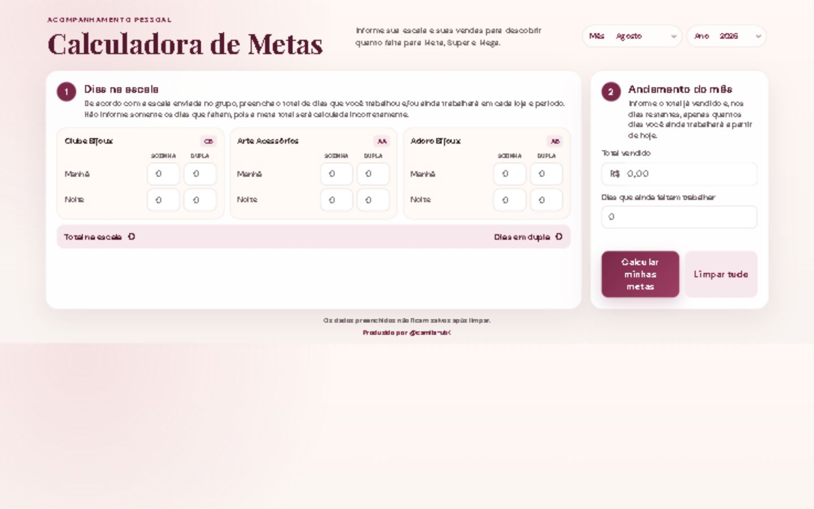
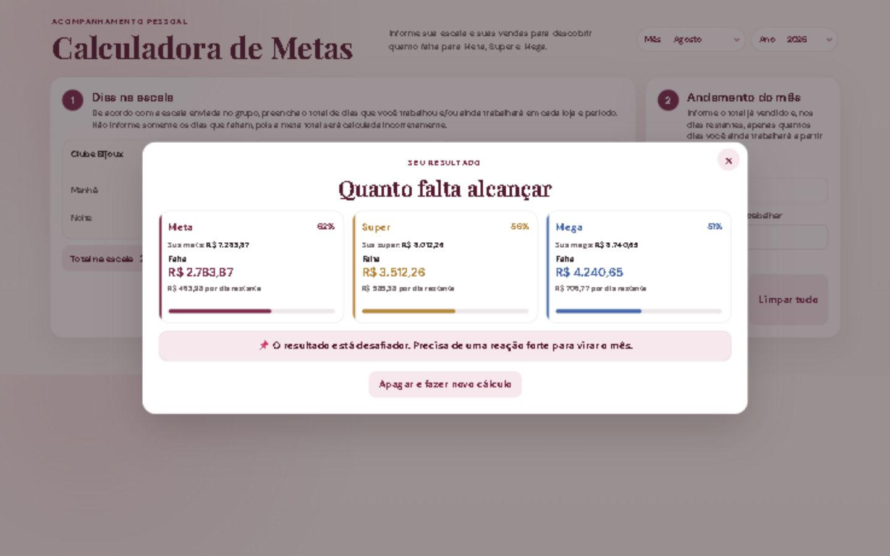

# Calculadora de Metas

Aplicação web para acompanhamento de metas pessoais com base na escala de trabalho e nas vendas realizadas no mês.

[Abrir a Calculadora de Metas](https://camila-ubt.github.io/calculo-metas/)

## Capturas de tela

### Tela principal

### Resultado do cálculo

## Documentação

A documentação completa, incluindo guia de uso, regras de cálculo, integração, arquitetura, segurança e histórico de versões, está disponível na [Wiki do projeto](https://github.com/camila-ubt/calculo-metas/wiki).

## Versão atual

**v1.0.0 — Primeira versão oficial**
